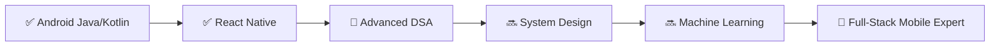

<h1 align="center">
  <a href="https://git.io/typing-svg">
    
  </a>
</h1>

<p align="center">
  
  &nbsp;
  
  &nbsp;
  
  &nbsp;
  
</p>

<p align="center">
  <a href="https://github.com/ryo-ma/github-profile-trophy">
    
  </a>
</p>

---

## 🧑‍💻 About Me


- 🔭 **Current Project:** [Real-Time Mobile Apps (React Native & Android)](https://github.com/KAUSHDWI)
- 🌱 **Learning Journey:** Data Structures & Algorithms · Machine Learning · React Native
- 👯 **Collaborations:** Open-source Mobile App Projects
- 🤝 **Focus Area:** Advanced DSA and System Design
- 💬 **Ask me about:** Java · Kotlin · React Native · Android Development
- 📫 **Email:** [kaushlendradwivedi21@gmail.com](mailto:kaushlendradwivedi21@gmail.com)
- 📄 **Resume:** [View My Experience](https://drive.google.com/file/d/1CgHBYQOMtGRPfwQo2KHRnjS7ro49QD4F/view?usp=drive_link)
- 🌍 **Location:** India
- ⚡ **Fun Fact:** I treat every bug as a mystery and every fix as a victory 🏆

<br clear="right"/>

---

## 🚀 What I'm Currently Up To

```text
🔨  Building     →  Real-time chat & notification system in React Native
📖  Reading      →  Clean Code by Robert C. Martin
🧠  Practicing   →  LeetCode DSA problems daily
🎯  Goal 2025    →  Land a full-time SDE role & contribute to major OSS
```

---


---

---

## 🎓 Knowledge & Proficiency

| Skill | Proficiency |
|---|---|
| **Android (Java / Kotlin)** |  |
| **React Native / JS** |  |
| **Data Structures (DSA)** |  |
| **Backend (Node/ Python)** |  |
| **Machine Learning** |  |
| **System Design** |  |

---

## 🗺️ My Learning Roadmap



---

## 📊 "How Much I Code" — Activity Graph

<p align="center">
  
</p>

<p align="center">
  
  
</p>

---

## 🛠 Tech Stack & Tools

<p align="center">
  
</p>

---

## 📅 Weekly Dev Breakdown

> 🕐 Auto-updated via WakaTime — [set it up here](https://wakatime.com)

```text
Kotlin        ██████████░░░░░░░░░░   45%
React Native  ███████░░░░░░░░░░░░░   30%
JavaScript    ████░░░░░░░░░░░░░░░░   15%
Python        ██░░░░░░░░░░░░░░░░░░   10%
```

---

## 🤝 Connect With Me

<p align="center">
  <a href="https://www.linkedin.com/in/kaushlendra-kumar-dwivedi-7050422b1/" target="_blank">
    
  </a>&nbsp;
  <a href="https://leetcode.com/u/kaush_dwivedi/" target="_blank">
    
  </a>&nbsp;
  <a href="https://www.hackerrank.com/profile/kaushlendradwiv1" target="_blank">
    
  </a>&nbsp;
  <a href="https://www.topcoder.com/members/201310" target="_blank">
    
  </a>&nbsp;
  <a href="mailto:kaushlendradwivedi21@gmail.com">
    
  </a>
</p>

---

## 🐍 Coding Journey Animation

<p align="center">
  
</p>

<p align="center">
  <picture>
    <source media="(prefers-color-scheme: dark)" srcset="https://raw.githubusercontent.com/Platane/snk/output/github-contribution-grid-snake-dark.svg" />
    <source media="(prefers-color-scheme: light)" srcset="https://raw.githubusercontent.com/Platane/snk/output/github-contribution-grid-snake.svg" />
    
  </picture>
</p>

---

<p align="center">
  
</p>

<p align="center">
  <b>"Code is not just logic — it's how I speak to the world." 🌍</b>
</p>
